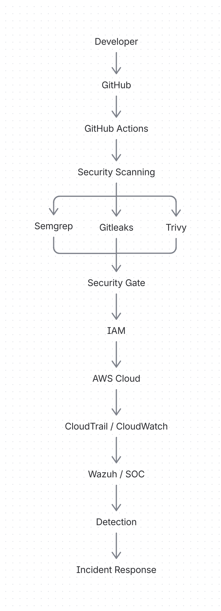
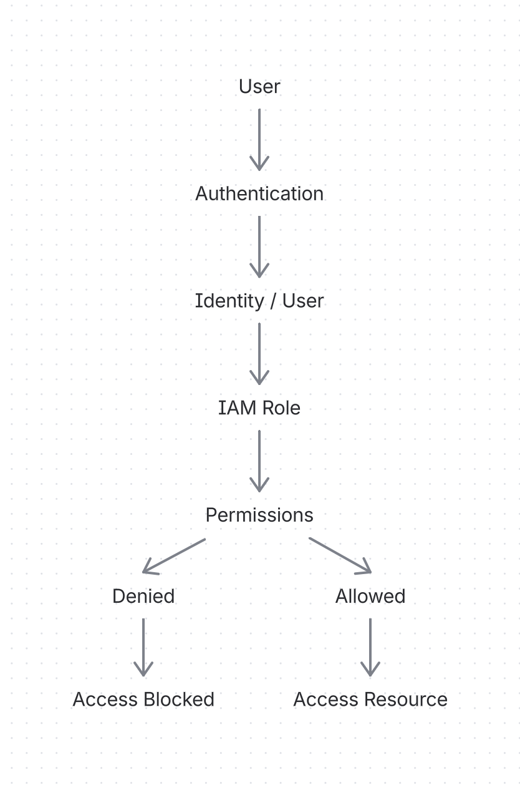

# 5. Documentation & Reporting

## Project Objective
The main objective is to design and implement a secure DevSecOps environment integrating:

IAM + Cloud + Git/GitHub + CI/CD + DevSecOps + Logging & Monitoring + SOC

The project will demonstrate how these components work together to prevent, detect, investigate, and respond to security issues.

## Architecture Diagrams
Architecture diagrams will be used to visually explain the project structure and communication between components.

### Main architecture diagram

### IAM Architecture

### CI/CD Architecture

### SOC Architecture

