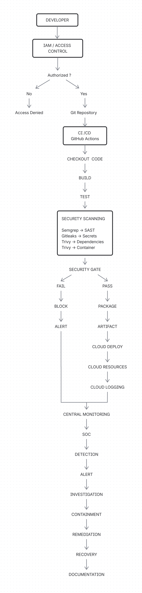

# Project Selection & Scope Definition

## Project Title
Secure DevSecOps Cloud Pipeline with IAM and SOC Monitoring

## 1. Project Objectives
The main objective of this project is to design and implement a secure DevSecOps environment that integrates IAM, cloud infrastructure, Git/GitHub, CI/CD, security testing, logging, monitoring, and SOC operations.

The project aims to:
- Implement IAM using authentication, authorization, and least privilege.
- Build a secure cloud environment using AWS.
- Use Git and GitHub for source-code management.
- Create an automated CI/CD pipeline using GitHub Actions.
- Integrate security tools such as Semgrep, Gitleaks, and Trivy into the pipeline.
- Use security gates to prevent insecure changes from being deployed.
- Implement cloud logging and monitoring.
- Detect and investigate selected security events using a SOC/SIEM platform.
- Demonstrate a basic incident-response process.

---

## 2. Security Goals
The project focuses on the following security goals:

**Confidentiality**  
Protect credentials, configuration, source code, and other sensitive information from unauthorized access.

**Integrity**  
Protect source code, CI/CD workflows, configurations, and cloud resources from unauthorized modification.

**Availability**  
Maintain the availability of the project environment while applying appropriate security controls.

---

## 3. Least Privilege
Provide users and services only the permissions required for their tasks.

- **Prevention**: Prevent insecure code, exposed secrets, and vulnerable components from progressing through the pipeline.  
- **Detection**: Detect suspicious activities using logging, monitoring, security scanning, and SOC capabilities.  
- **Incident Response**: Provide a process for handling detected security events.  

---

## 4. Project Scope
The project includes:
- AWS cloud infrastructure  
- AWS IAM  
- VPC and Security Groups  
- Git and GitHub  
- GitHub Actions CI/CD  
- Semgrep for SAST  
- Gitleaks for secret detection  
- Trivy for vulnerability scanning  
- Docker where required  
- CloudTrail and CloudWatch for logging and monitoring  
- Wazuh/SOC monitoring  
- Threat modeling  
- Risk assessment  
- Incident response  
- Security testing using controlled lab scenarios  

The project will not include:
- Production enterprise infrastructure  
- Real customer data or credentials  
- Attacks against external systems  
- Large-scale Active Directory deployment  
- Enterprise-scale 24/7 SOC operations  
- Advanced malware analysis  
- Large Kubernetes or multi-region environments  

The project will remain within a controlled and authorized lab environment.

---

## 5. Stakeholders
| Stakeholder                 | Responsibility                                |
|-----------------------------|-----------------------------------------------|
| Project Engineer / Student  | Design, implementation, testing, documentation|
| Trainer / Supervisor        | Guidance and evaluation                       |
| Developer                   | Source-code development and Git workflow      |
| DevOps Engineer             | CI/CD and deployment                          |
| Cloud Engineer              | AWS infrastructure and IAM                    |
| SOC Analyst                 | Monitoring, detection and investigation       |
| Examiner                    | Final project evaluation                      |

For this academic project, multiple roles are performed by the same person.

---

## 6. Success Criteria
The project will be considered successful when:
- IAM permissions are implemented using least privilege.  
- Unauthorized test actions are correctly denied.  
- GitHub successfully manages project source code.  
- A GitHub event automatically triggers the CI/CD pipeline.  
- Semgrep performs security analysis.  
- Gitleaks detects a controlled test secret.  
- Trivy identifies applicable vulnerabilities.  
- Security findings can cause the pipeline to fail according to the defined security policy.  
- Approved changes can be deployed to AWS.  
- Relevant cloud activities are logged.  
- Security events can be monitored.  
- Selected suspicious activity can generate or support a SOC alert.  
- The alert can be investigated.  
- At least one controlled incident scenario demonstrates detection, investigation, containment, remediation, and recovery.  

---
## 7. Overall Project Flow

---
## 8. Project Outcome
The final project will demonstrate how IAM, cloud security, DevSecOps, CI/CD, logging, monitoring, and SOC operations can be integrated into a single security architecture.
